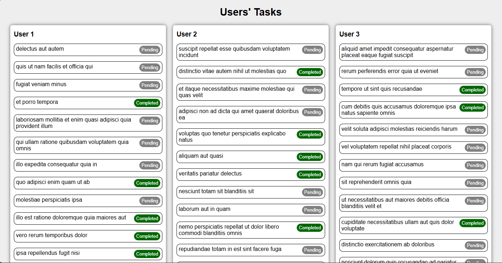

## Fetched Users' Todo List

This demonstrates my understanding of async await, for asynchronous data fetching alongside the try-catch for proper error handling.

I was also able to apply my knowledge of DOM manipulation to display the todo list on the webpage

#### Output

